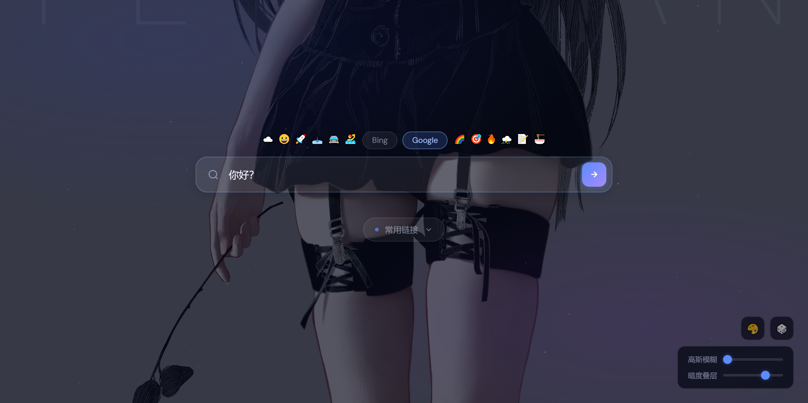
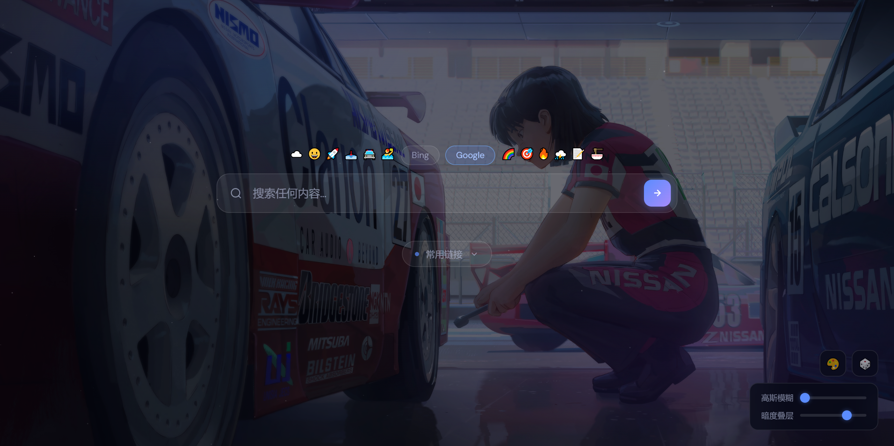

# Search Home

`Search Home` 是一个基于 `React + Vite + Express` 的可定制首页项目，适合作为浏览器起始页或个人导航页。

项目提供这些功能：

- 搜索框，支持 `Google` / `Bing` 切换
- 快捷链接管理，支持新增、编辑、删除
- 链接图标支持 `Emoji` 或站点 `favicon`
- 背景图片上传、切换、删除
- 背景模糊、遮罩、显示位置调整
- 本地文件持久化，不依赖数据库

项目采用前后端同仓库模式：

- 前端由 `Vite` 提供开发体验
- 后端由 `Express` 提供 API 和生产环境静态资源托管

## 截图




## 技术栈

- 前端：`React 19`、`Vite`
- 后端：`Node.js`、`Express`
- 图片处理：`Sharp`
- 文件上传：`Multer`
- 代码检查：`ESLint`

## 环境要求

- Node.js `18+`
- npm `9+`
- Docker，可选
- Docker Compose / `docker compose`，可选

## 本地开发

### 1. 安装依赖

```bash
npm install
```

### 2. 启动后端

```bash
npm run server
```

后端默认地址：

- `http://localhost:39421`

### 3. 启动前端

新开一个终端，在项目根目录执行：

```bash
npm run dev
```

前端默认地址：

- `http://localhost:5173`

开发时请访问：

- `http://localhost:5173`

### 开发模式说明

开发模式下需要两个进程：

1. `npm run server`
2. `npm run dev`

Vite 已配置代理，以下请求会自动转发到后端：

- `/api`
- `/uploads`

## 生产运行

### 1. 构建前端

```bash
npm run build
```

### 2. 启动服务

```bash
npm start
```

生产环境访问地址：

- `http://localhost:39421`

此时 Express 会同时负责：

- 提供 API
- 提供上传文件访问
- 托管 `dist/` 中的前端构建产物

## Docker 使用方式

当前项目已经发布到 Docker Hub：

- `theysh0303/search-home:latest`

对于普通用户，推荐直接拉取镜像运行，不需要本地构建。

### 启动前准备

如果你是第一次运行，请先准备运行时数据文件：

Windows:

```powershell
copy links.example.json links.json
copy background.example.json background.json
```

macOS / Linux:

```bash
cp links.example.json links.json
cp background.example.json background.json
```

并确保存在上传目录：

```bash
mkdir uploads
```

Windows PowerShell:

```powershell
mkdir uploads
```

### 方式一：直接使用 Docker 拉取并运行

先拉取镜像：

```bash
docker pull theysh0303/search-home:latest
```

然后启动容器：

```bash
docker run -d \
  --name search-home \
  -p 39421:39421 \
  -v ${PWD}/uploads:/app/uploads \
  -v ${PWD}/links.json:/app/links.json \
  -v ${PWD}/background.json:/app/background.json \
  theysh0303/search-home:latest
```

如果你是 Windows PowerShell，推荐使用：

```powershell
docker run -d `
  --name search-home `
  -p 39421:39421 `
  -v ${PWD}\uploads:/app/uploads `
  -v ${PWD}\links.json:/app/links.json `
  -v ${PWD}\background.json:/app/background.json `
  theysh0303/search-home:latest
```

启动完成后访问：

- `http://localhost:39421`

### 方式二：使用 Docker Compose

项目中的 [`docker-compose.yml`](/F:/ysh_loc_office/projects/home/docker-compose.yml) 默认直接使用 Docker Hub 镜像，不需要本地构建。

启动：

```bash
docker compose up -d
```

停止：

```bash
docker compose down
```

如果需要先手动拉取最新镜像：

```bash
docker compose pull
docker compose up -d
```

启动完成后访问：

- `http://localhost:39421`

当前 `docker-compose.yml` 做了这些事：

- 使用镜像 `theysh0303/search-home:latest`
- 暴露端口 `39421`
- 挂载 `uploads`
- 挂载 `links.json`
- 挂载 `background.json`

### 方式三：开发者自行构建镜像

如果你要修改代码并自行构建镜像，项目仍然保留了 [`Dockerfile`](/F:/ysh_loc_office/projects/home/Dockerfile)。

构建：

```bash
docker build -t search-home:local .
```

运行：

```bash
docker run -d \
  --name search-home-local \
  -p 39421:39421 \
  -v ${PWD}/uploads:/app/uploads \
  -v ${PWD}/links.json:/app/links.json \
  -v ${PWD}/background.json:/app/background.json \
  search-home:local
```

## 可用脚本

- `npm run dev`：启动 Vite 开发服务器
- `npm run server`：启动 Express 服务
- `npm start`：启动 Express 服务
- `npm run build`：构建前端到 `dist/`
- `npm run preview`：预览前端构建产物
- `npm run lint`：执行 ESLint

## 目录结构

```text
.
├─ src/
│  ├─ components/          # 通用组件
│  ├─ constants/           # 常量和默认配置
│  ├─ features/            # 按业务划分的功能模块
│  ├─ hooks/               # 自定义 hooks
│  ├─ services/api/        # 前端 API 封装
│  ├─ styles/              # 全局样式
│  └─ utils/               # 工具函数
├─ image_github/           # README 截图
├─ uploads/                # 运行期上传文件目录
├─ background.example.json # 背景配置示例
├─ background.json         # 运行期背景配置
├─ emoji_data.json         # Emoji 数据
├─ index.html              # Vite 入口 HTML
├─ links.example.json      # 快捷链接示例
├─ links.json              # 运行期快捷链接数据
├─ server.js               # Express 服务和 API
├─ vite.config.js          # Vite 配置
├─ Dockerfile              # 本地构建 Docker 镜像
├─ docker-compose.yml      # 直接使用 Docker Hub 镜像启动
└─ README.md
```

## 运行期数据

项目会将运行期数据保存在本地文件中。

主要包括：

- `uploads/`
- `uploads/originals/`
- `uploads/display/`
- `uploads/thumbs/`
- `links.json`
- `background.json`

如果这些文件或目录不存在，后端启动时会自动创建。  
但如果你通过 Docker 文件挂载运行，建议先在宿主机侧准备这些文件，避免挂载失败。

## 背景图片处理说明

上传背景图后，后端会自动生成三类资源：

- 原图：`uploads/originals/`
- 页面展示图：`uploads/display/`
- 缩略图：`uploads/thumbs/`

背景配置保存在 `background.json` 中，包括：

- `filename`
- `blur`
- `dim`
- `positionX`
- `positionY`

## API 概览

| Method | Path | 说明 |
| --- | --- | --- |
| `GET` | `/api/emojis` | 获取 Emoji 分类数据 |
| `GET` | `/api/links` | 读取快捷链接 |
| `POST` | `/api/links` | 保存快捷链接 |
| `GET` | `/api/background` | 读取背景配置 |
| `POST` | `/api/background` | 保存背景配置 |
| `GET` | `/api/images` | 获取已上传图片列表 |
| `POST` | `/api/upload` | 上传背景图片 |
| `DELETE` | `/api/upload/:filename` | 删除背景图片 |

## 常见问题

### 页面打开了，但接口请求失败

请确认后端是否已经启动：

```bash
npm run server
```

### 生产环境页面空白

请确认你已经先执行构建：

```bash
npm run build
npm start
```

### 上传图片后无法显示

请检查：

- 后端是否正在运行
- `uploads/` 是否存在
- 浏览器是否能访问 `/uploads/...`

### Docker 启动时报 `links.json` 或 `background.json` 挂载错误

说明宿主机上还没有这两个文件。先复制示例文件：

Windows:

```powershell
copy links.example.json links.json
copy background.example.json background.json
```

macOS / Linux:

```bash
cp links.example.json links.json
cp background.example.json background.json
```

## 建议的阅读顺序

如果你第一次接手这个项目，建议按这个顺序阅读：

1. `server.js`
2. `src/App.jsx`
3. `src/features/search/`
4. `src/features/links/`
5. `src/features/background/`

这样能最快理解整个项目的运行方式。

## License

MIT
